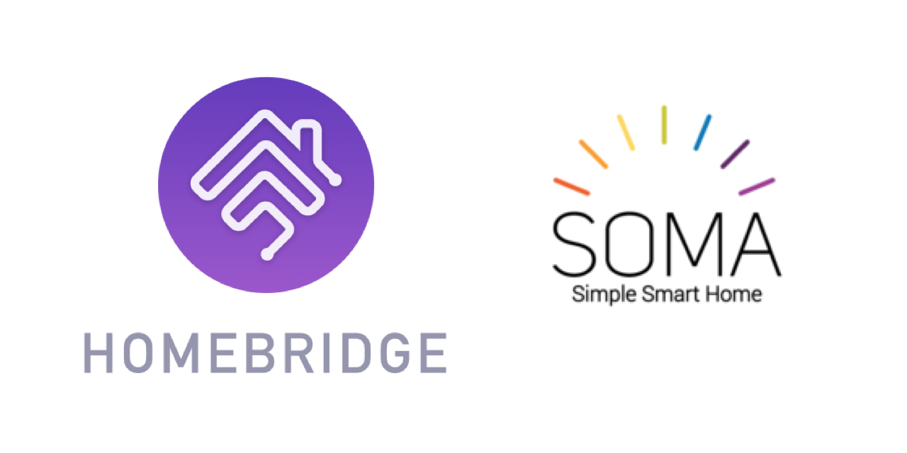

<p align="center">
    
</p>
<span align="center">

# Homebridge SC
[](https://www.npmjs.com/package/homebridge-sc)
[](https://www.npmjs.com/package/homebridge-sc)
[](https://discord.gg/yGvADWt)
<!-- [](https://github.com/homebridge/homebridge/wiki/Verified-Plugins) -->

[](https://github.com/ebaauw/homebridge-sc/issues)
[](https://github.com/ebaauw/homebridge-sc/pulls)
[](https://standardjs.com)

</span>

## Homebridge plugin for SOMA Connect
Copyright © 2021 Erik Baauw. All rights reserved.

This [Homebridge](https://github.com/homebridge/homebridge) plugin exposes
[SOMA Smart Shades 2](https://eu.somasmarthome.com) and
[SOMA Tilt 2](https://eu.somasmarthome.com/pages/smart-tilt) devices, connected to a
[SOMA Connect](https://eu.somasmarthome.com/products/soma-connect-blinds-control-for-amazon-alexa-apple-homekit-google-home),
to Apple's [HomeKit](https://www.apple.com/ios/home/).

This plugin does not depend on Bluetooth Low Energy (BLE) support on the server running Homebridge.
It uses the [HTTP API](https://support.somasmarthome.com/hc/en-us/articles/360026064234-HTTP-API)
of the SOMA Connect to interact with the SOMA devices.
Note that this API is currently in beta.

Note that the SOMA Connect provides native Homebridge support.
However, I find that support lacking:
- It doesn't expose the battery;
- It exposes _Close Upwards_ and _Morning Mode_ as write-only characteristics, which most HomeKit apps don't like.
- It doesn't report in which direction ("up" or "down") the blinds are closed.

This plugin is my proof-of-concept how better to expose the SOMA Tilt.
I hope to feedback my findings to Wazombi Labs for inclusion in the SOMA Connect.

### SOMA Connect
SOMA Connect is available as a Raspberry Pi image [here](https://support.somasmarthome.com/hc/en-us/articles/360035521234-Install-SOMA-Connect-software).
It can also be written to an SD card using the [Raspberry Pi Imager](https://www.raspberrypi.org/software/).
The image provides the light version of PiOS, without the graphical environment.
I'm now running it on a Pi 3B+, connected to the network wired over Ethernet,
after some stability issues using a Pi Zero W, over WiFi.

SSH access is disabled by default, but easily enabled by placing an `ssh` file in the boot partition of the SD card, see [SSH](https://www.raspberrypi.org/documentation/remote-access/ssh/).
That way, you don't need to connect a monitor and keyboard.
After installing `pigpio`, the Pi can be monitored remotely by [Homebridge RPi](https://github.com/ebaauw/homebridge-rpi).

It looks like the SOMA Connect software is based on [HAP-NodeJS](https://github.com/homebridge/HAP-NodeJS) alright, but, unfortunately, it's not open source.
They seem to have packaged NodeJS, HAP-NodeJS and the SOMA-specific Javascript code into a single `soma-connect` executable.
There doesn't seem to be an easy way to enhance their Javascript code.
The executable runs as `root`, probably to interact with the Bluetooth Low Energy hardware.
It looks like `soma-connect` opens the mDNS port exclusively, so running Homebridge on the same Raspberry Pi as SOMA Connect doesn't seem feasible.

### Work in Progress
Note that this plugin is still under development.

### Command-Line Tool
Homebridge SC include a command-line tool, `sc`, to interact with the SOMA Connect from the command line.
It takes a `-h` or `--help` argument to provide a brief overview of its functionality and command-line arguments.

### Configuration
In Homebridge's `config.json` you need to specify Homebridge SC as a platform
plugin, and provide the IP address of the SOMA Connect.

```json
  "platforms": [
    {
      "platform": "SC",
      "hosts": ["192.168.x.x"]
    }
  ]
```
